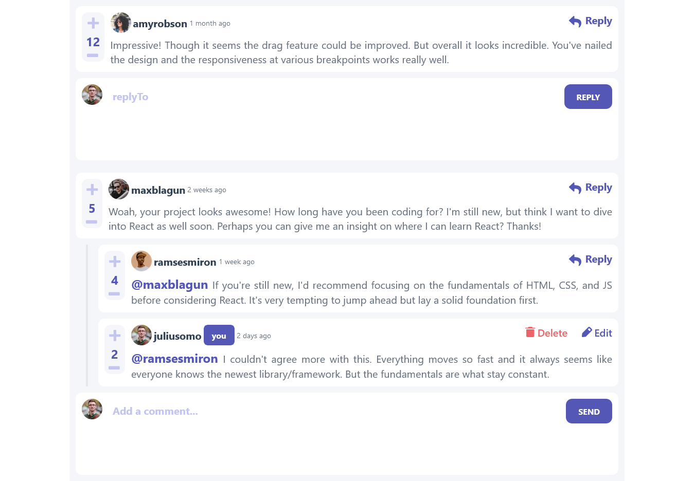
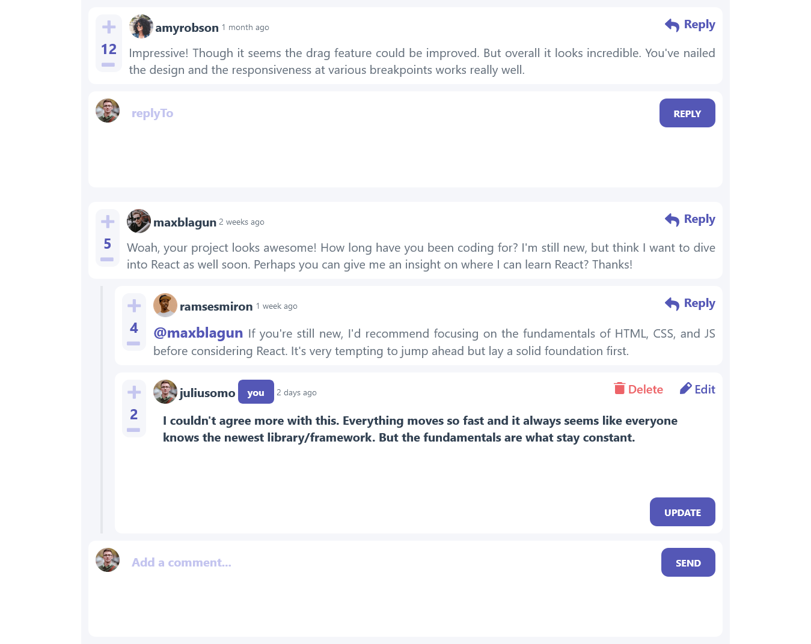
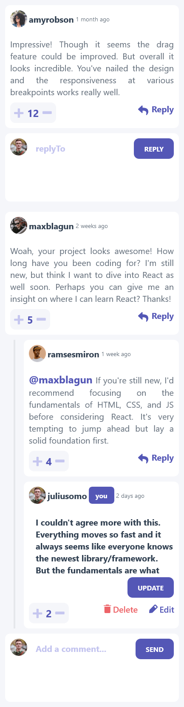

# Frontend Mentor - Interactive comments section solution

This is a solution to the [Interactive comments section challenge on Frontend Mentor](https://www.frontendmentor.io/challenges/interactive-comments-section-iG1RugEG9). Frontend Mentor challenges help you improve your coding skills by building realistic projects.

## Table of contents

- [Overview](#overvi)
  - [The challenge](#the-challenge)
  - [Screenshot](#screenshot)
  - [Links](#links)
- [My process](#my-process)
  - [Built with](#built-with)
  - [What I learned](#what-i-learned)
  - [Continued development](#continued-development)
  - [Useful resources](#useful-resources)
- [Author](#author)

**Note: Delete this note and update the table of contents based on what sections you keep.**

## Overview

### The challenge

Users should be able to:

- View the optimal layout for the app depending on their device's screen size
- See hover states for all interactive elements on the page
- Create, Read, Update, and Delete comments and replies
- Upvote and downvote comments
- **Bonus**: If you're building a purely front-end project, use `localStorage` to save the current state in the browser that persists when the browser is refreshed.
- **Bonus**: Instead of using the `createdAt` strings from the `data.json` file, try using timestamps and dynamically track the time since the comment or reply was posted.

### Screenshot

<div style=" display: flex;
  flex-wrap: wrap;gap:0.5rem" >



<!--  -->
</div>

### Links

- Solution URL: [Solution URL](https://github.com/KhalifahMB/comment-section)
- Live Site URL: [Live site URL](https://elkufahn-comment-section.netlify.app/)

## My process

### Built with

- Flexbox
- CSS Grid
- Mobile-first workflow
- [React](https://reactjs.org/) - JS library
- [Tailwindcss](https://tailwindcss.com/) - CSS library

### What I learned

I learnt more about how recursion works, iterating through nested arrays and so on.
I also learnt about data structures

Here are example of some of the code i am proud of

```js
// function to update a component score, the minimum score is score
const updateCommentScore = (comments, id, type) => {
  return comments.map((comment) => {
    if (comment.id == id) {
      switch (type) {
        case "plus":
          return { ...comment, score: (comment.score += 1) };
        case "minus":
          if (comment.score > 0) {
            return { ...comment, score: (comment.score -= 1) };
          }
          return { ...comment };
        default:
          return { ...comment };
      }
    }
    if (comment.replies?.length > 0) {
      const updatedRepliesScores = updateCommentScore(
        comment.replies,
        id,
        type
      );
      if (updatedRepliesScores) {
        return { ...comment, replies: [...updatedRepliesScores] };
      }
    }

    return comment;
  });
};
```

```js
// function to update a comment content or editing
const updateCommentContent = (comments, id, content) => {
  return comments.map((comment) => {
    if (comment.id == id) {
      return { ...comment, content };
    }
    if (comment.replies?.length > 0) {
      const updatedRepliesScores = updateCommentScore(
        comment.replies,
        id,
        content
      );
      if (updatedRepliesScores) {
        return { ...comment, replies: [...updatedRepliesScores] };
      }
    }

    return comment;
  });
};
```

```js
// function to add replies to a comment
const updateCommentReplies = (comments, parentId, content) => {
  return comments.map((comment) => {
    if (comment.id == parentId) {
      content.replyingTo = comment.user.username;
      const updatedReplies = [...comment.replies, content];
      return { ...comment, replies: [...updatedReplies] };
    }

    if (comment.replies?.length > 0) {
      const updatedCommentReplies = updateCommentReplies(
        comment.replies,
        parentId,
        content
      );
      if (updatedCommentReplies) {
        return { ...comment, replies: [...updatedCommentReplies] };
      }
    }

    return comment;
  });
};
```

```js
// function for deleting a single comment
const deleteComment = (comments, id) => {
  const newComments = [];
  for (const comment of comments) {
    if (comment.id == id) {
      //
    } else {
      const upDatedReplies = comment.replies
        ? deleteComment(comment.replies, id)
        : [];
      newComments.push({ ...comment, replies: upDatedReplies });
    }
  }
  return newComments;
};
```

### Continued development

In the future i might decide to add signup and login functionality and so on ...

### Useful resources

- [Flowbite React](https://www.flowbite-react.com/) - This helped me for creating the delete modal.Flowbite React is an open-source UI component library built on top of Tailwind CSS with React components and based on the Flowbite Design System.

## Author

- Github - [KhalifahMB](https://github.com/KhalifahMB/)
- Frontend Mentor - [@KhalifahMB](https://www.frontendmentor.io/profile/KhalifahMB)
- Twitter - [@KhalifahMB](https://www.twitter.com/khalifahmb)
